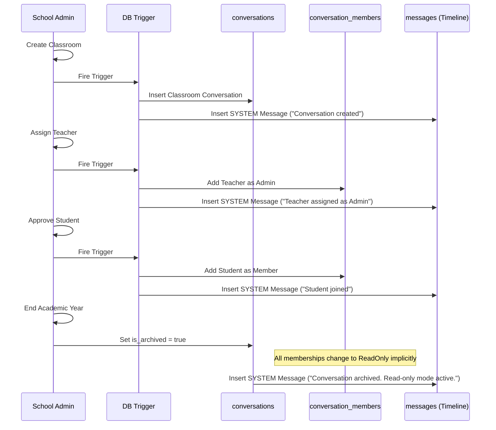

# PHASE 4D: Classroom & School Communication System – Architecture Revision

This document presents the revised architecture for **Phase 4D – Classroom Communication Channels**, designing a reusable, generic conversation engine capable of serving all current and future CampusLink communication features (School Communities, Classroom Channels, Direct Messaging, Parents Channels, Clubs, and Sports Teams).

---

## 1. Updated Database Architecture

All communication tables are generic, platform-agnostic, and support extensible configuration parameters.

### Entity Relationship Diagram (Conceptual Schema)

```
[conversations] ──1:N── [conversation_members]
      │
      ├──1:N── [messages] ──1:N── [message_reactions]
      │              │
      │              ├──1:N── [message_reads]
      │              └──1:N── [message_mentions]
      │
      ├──1:1── [conversation_settings]
      ├──1:N── [conversation_pins]
      └──1:N── [conversation_audit_logs]
```

### Table Specifications & Constraints

#### Table 1: `conversations`
Tracks active and archived conversation spaces.
```sql
CREATE TABLE conversations (
  id UUID PRIMARY KEY DEFAULT gen_random_uuid(),
  school_id UUID NOT NULL, -- References school profiles
  classroom_id UUID NULL, -- References classrooms (only for CLASSROOM channels)
  academic_year_id UUID NULL, -- References academic years
  name VARCHAR(255) NOT NULL,
  description TEXT NULL,
  avatar_url TEXT NULL,
  type VARCHAR(50) NOT NULL, -- 'SCHOOL', 'CLASSROOM', 'DIRECT_MESSAGE', 'PARENT', 'TEACHER', 'CLUB', 'SYSTEM'
  is_archived BOOLEAN DEFAULT FALSE NOT NULL,
  created_by UUID NULL, -- References profiles(id)
  created_at TIMESTAMPTZ DEFAULT NOW() NOT NULL,
  updated_at TIMESTAMPTZ DEFAULT NOW() NOT NULL
);

CREATE INDEX idx_conversations_school ON conversations(school_id);
CREATE INDEX idx_conversations_classroom ON conversations(classroom_id) WHERE classroom_id IS NOT NULL;
```

#### Table 2: `conversation_members`
Junction table mapping users to channels.
```sql
CREATE TABLE conversation_members (
  id UUID PRIMARY KEY DEFAULT gen_random_uuid(),
  conversation_id UUID REFERENCES conversations(id) ON DELETE CASCADE NOT NULL,
  user_id UUID NOT NULL, -- References profiles(id)
  role VARCHAR(50) DEFAULT 'Member' NOT NULL, -- 'Owner', 'Admin', 'Moderator', 'Member', 'ReadOnly'
  joined_at TIMESTAMPTZ DEFAULT NOW() NOT NULL,
  left_at TIMESTAMPTZ NULL, -- Tracks historic memberships
  unread_count INT DEFAULT 0 NOT NULL,
  is_muted BOOLEAN DEFAULT FALSE NOT NULL,
  created_at TIMESTAMPTZ DEFAULT NOW() NOT NULL,
  CONSTRAINT unique_active_member UNIQUE (conversation_id, user_id) WHERE left_at IS NULL
);

CREATE INDEX idx_conv_members_user ON conversation_members(user_id);
```

#### Table 3: `messages`
The single source of truth for the chronological timeline feed. Supports soft delete and edit tracking.
```sql
CREATE TABLE messages (
  id UUID PRIMARY KEY DEFAULT gen_random_uuid(),
  conversation_id UUID REFERENCES conversations(id) ON DELETE CASCADE NOT NULL,
  sender_id UUID NULL, -- References profiles(id). NULL indicates system message
  content TEXT NOT NULL,
  type VARCHAR(50) DEFAULT 'TEXT' NOT NULL, -- 'TEXT', 'IMAGE', 'VIDEO', 'DOCUMENT', 'VOICE', 'LOCATION', 'SYSTEM', 'HOMEWORK', 'ATTENDANCE', 'EVENT', 'POLL', 'AI'
  metadata JSONB NULL, -- Flexible payload mapping (homework_id, event_date, file_size, attachment_url)
  parent_message_id UUID REFERENCES messages(id) NULL, -- For reply threads
  edited_at TIMESTAMPTZ NULL,
  edited_by UUID NULL, -- References profiles(id)
  deleted_at TIMESTAMPTZ NULL, -- Soft delete timestamp
  deleted_by UUID NULL, -- References profiles(id) who executed delete
  created_at TIMESTAMPTZ DEFAULT NOW() NOT NULL
);

CREATE INDEX idx_messages_conversation ON messages(conversation_id, created_at DESC);
```

#### Table 4: `message_reads`
Read receipt mapping.
```sql
CREATE TABLE message_reads (
  id UUID PRIMARY KEY DEFAULT gen_random_uuid(),
  message_id UUID REFERENCES messages(id) ON DELETE CASCADE NOT NULL,
  user_id UUID NOT NULL, -- References profiles(id)
  read_at TIMESTAMPTZ DEFAULT NOW() NOT NULL,
  UNIQUE(message_id, user_id)
);
```

#### Table 5: `message_reactions`
Emoji reactions linked to messages.
```sql
CREATE TABLE message_reactions (
  id UUID PRIMARY KEY DEFAULT gen_random_uuid(),
  message_id UUID REFERENCES messages(id) ON DELETE CASCADE NOT NULL,
  user_id UUID NOT NULL, -- References profiles(id)
  emoji VARCHAR(50) NOT NULL,
  UNIQUE(message_id, user_id, emoji)
);
```

#### Table 6: `message_mentions`
Mentions helper to fire notifications.
```sql
CREATE TABLE message_mentions (
  id UUID PRIMARY KEY DEFAULT gen_random_uuid(),
  message_id UUID REFERENCES messages(id) ON DELETE CASCADE NOT NULL,
  user_id UUID NOT NULL, -- References profiles(id)
  UNIQUE(message_id, user_id)
);
```

#### Table 7: `conversation_settings`
Flexible role permission thresholds mapping actions to hierarchical levels.
```sql
CREATE TABLE conversation_settings (
  id UUID PRIMARY KEY DEFAULT gen_random_uuid(),
  conversation_id UUID REFERENCES conversations(id) ON DELETE CASCADE UNIQUE NOT NULL,
  send_messages_threshold VARCHAR(50) DEFAULT 'Member' NOT NULL,  -- 'Everyone', 'Member', 'Moderator', 'Admin', 'Owner'
  edit_info_threshold VARCHAR(50) DEFAULT 'Admin' NOT NULL,
  change_photo_threshold VARCHAR(50) DEFAULT 'Admin' NOT NULL,
  pin_messages_threshold VARCHAR(50) DEFAULT 'Moderator' NOT NULL,
  add_members_threshold VARCHAR(50) DEFAULT 'Admin' NOT NULL,
  remove_members_threshold VARCHAR(50) DEFAULT 'Admin' NOT NULL,
  mention_everyone_threshold VARCHAR(50) DEFAULT 'Moderator' NOT NULL,
  delete_messages_threshold VARCHAR(50) DEFAULT 'Admin' NOT NULL,
  created_at TIMESTAMPTZ DEFAULT NOW() NOT NULL,
  updated_at TIMESTAMPTZ DEFAULT NOW() NOT NULL
);
```

#### Table 8: `conversation_pins`
Supports multiple pinned messages per channel with a sorting order.
```sql
CREATE TABLE conversation_pins (
  id UUID PRIMARY KEY DEFAULT gen_random_uuid(),
  conversation_id UUID REFERENCES conversations(id) ON DELETE CASCADE NOT NULL,
  message_id UUID REFERENCES messages(id) ON DELETE CASCADE NOT NULL,
  pinned_by UUID NOT NULL, -- References profiles(id)
  pin_order INT NOT NULL DEFAULT 0, -- Ordered queue
  created_at TIMESTAMPTZ DEFAULT NOW() NOT NULL,
  UNIQUE(conversation_id, message_id)
);
```

#### Table 9: `conversation_audit_logs`
Historical event trail.
```sql
CREATE TABLE conversation_audit_logs (
  id UUID PRIMARY KEY DEFAULT gen_random_uuid(),
  conversation_id UUID REFERENCES conversations(id) ON DELETE CASCADE NOT NULL,
  actor_id UUID NULL, -- References profiles(id)
  action VARCHAR(100) NOT NULL, -- 'MEMBER_JOIN', 'MEMBER_LEAVE', 'ROLE_CHANGE', 'CHANNEL_ARCHIVED', 'SETTINGS_CHANGE'
  details JSONB NULL,
  created_at TIMESTAMPTZ DEFAULT NOW() NOT NULL
);
```

---

## 2. Conversation Engine Design

### Type Classifications
- `SCHOOL`: School Community. Acts as the bulletin board for all affiliated teachers and students.
- `CLASSROOM`: Dedicated classroom channels automatically spawned for each classroom.
- `DIRECT_MESSAGE`: One-on-one message channels between teachers, students, and school representatives.
- `TEACHER`: Staff channels restricted to teachers and administrators.
- `PARENT`: Parent-teacher communication streams.
- `CLUB`: Student interest circles (e.g. Science Club, Debate Society).
- `SYSTEM`: Logging feed for school broadcasts.

### Message Type Classifications & Metadata Payloads
1. **TEXT**: Normal messaging.
2. **IMAGE / VIDEO / DOCUMENT**: Attachments containing `url`, `file_name`, and `file_size` in the `metadata` JSONB.
3. **SYSTEM**: Automated platform log entries (e.g. *"Ahmed Khan joined classroom"*).
4. **HOMEWORK**: Triggers a timeline homework card. Metadata links `homework_id` and due date.
5. **ATTENDANCE**: Triggers attendance reports. Metadata maps daily percentage and marked stats.
6. **EVENT**: Opportunistic banners. Metadata holds `event_id` and venue details.
7. **POLL**: Interactive student polling. Metadata lists options and poll metrics.

---

## 3. Permission Matrix & Flexible Roles

### Role Hierarchies
Roles are ranked in ascending permission levels:
`ReadOnly` (0) < `Member` (1) < `Moderator` (2) < `Admin` (3) < `Owner` (4)

### Threshold Enforcement Logic
A member can perform an action if their role rank is **greater than or equal to** the action's threshold defined in `conversation_settings`.

| Action | Owner | Admin | Moderator | Member | ReadOnly | Default Threshold Setting |
| :--- | :---: | :---: | :---: | :---: | :---: | :---: |
| **Send Messages** | Yes | Yes | Yes | Yes | No | `Member` |
| **Pin Messages** | Yes | Yes | Yes | No | No | `Moderator` |
| **Mention Everyone** | Yes | Yes | Yes | No | No | `Moderator` |
| **Add Members** | Yes | Yes | No | No | No | `Admin` |
| **Remove Members** | Yes | Yes | No | No | No | `Admin` |
| **Edit Info** | Yes | Yes | No | No | No | `Admin` |
| **Change Photo** | Yes | Yes | No | No | No | `Admin` |
| **Delete Messages** | Yes | Yes | No | No | No | `Admin` |

---

## 4. Conversation Lifecycle & Automatic Member Flow



---

## 5. Future Extensibility (Timeline Integration)

This design functions as a unified timeline. Rather than writing duplicate notification hooks:
- **Homework Module**: Upon creating homework, it writes a record directly into `messages` with `type = 'HOMEWORK'` and the metadata details. It renders as an interactive card in the chat timeline.
- **Attendance Module**: When attendance is marked, a `type = 'ATTENDANCE'` system log is pushed, alerting students and parents on the feed immediately.
- **AI Teaching Assistant**: AI bot messages will use `type = 'AI'`, responding within the classroom channel when mentioned (`@AI_Assistant`).

---

## 6. Migration Notes

- **From Classroom Groups to Reusable Conversations**:
  - The previous model had `classroom_groups`, locking the codebase to classrooms only.
  - The revised engine handles school channels, club DMs, and parent panels via the `conversations` junction.
- **Archiving over Deleting**:
  - Previously classrooms were marked inactive. The new system supports soft-locking conversation scopes by flagging `is_archived = true`, switching all member authorization checks to read-only but preserving message audit histories.
