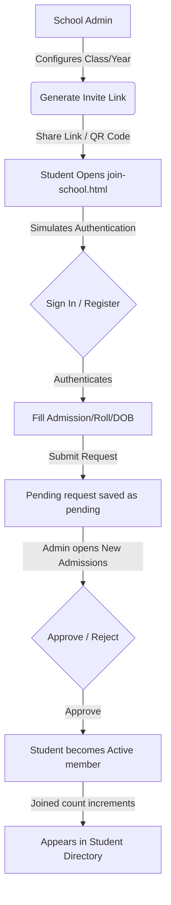

# Student Invitation System Report (Phase 4A)

This report summarizes the modifications and additions completed for the Student Onboarding Invitation System under the CampusLink School Admin Dashboard.

---

## 📂 Files Modified

1. **`dashboard.html`** ([dashboard.html](file:///e:/Owais/School%20Idea/SchoolIn/dashboard.html))
   - Replaced the primary action button `+ Add Student` with a split button dropdown component: `Invite Students` (primary action) and `Add Student Manually` (secondary dropdown item).
   - Appended the **Invite Links** button (`data-subtab="invite-links"`) to the sub-navigation tab bar.
   - Built the Invitation Manager subpanel (`#student-subpanel-invite-links`) containing local search/filters, status badge keys, responsive table grid, pagination indicators, and custom empty states.
   - Integrated two new system modals:
     - **Invite Students Modal** (`#student-invite-modal`) featuring Class/Year selectors (Screen 1) and generated link details with copy/QR toggles (Screen 2).
     - **QR Code View Modal** (`#student-qr-modal`) showing a simulated QR grid vector with metadata details.

2. **`students.js`** ([students.js](file:///e:/Owais/School%20Idea/SchoolIn/students.js))
   - Initialized mock invite states database (`DEFAULT_INVITES`) and synchronized it in the client-side `localStorage` cache.
   - Implemented list renderer (`renderInviteLinks()`) to dynamically populate the Invitation Manager grid with active/disabled badges and custom click handlers (Copy link, Toggle status, Delete, QR code view).
   - Wired split menu toggles and backdrop dismissal click events.
   - Enhanced the **New Admissions Approval Flow** to automatically detect student invitation codes upon approval, dynamically incrementing the matching invite's `joinedCount` metrics.

---

## 🆕 Components Added

1. **`join-school.html`** ([join-school.html](file:///e:/Owais/School%20Idea/SchoolIn/join-school.html))
   - Standalone student-facing landing page simulating the external invitation onboarding flow.
   - Handles query parameters (`?code=CL-9A-X72KD`) and validates invite validity and active status.
   - Simulates in-memory authenticating sessions (Sign In / Create Account).
   - Locks target classroom attributes (School, Year, Class, Section) automatically from the invite.
   - Offers fields for Admission Number, Roll Number, Date of Birth, Phone, and Guardian Name, and submits joining requests directly to the database.

---

## 🔄 Onboarding Workflow



---

## 📊 Invite Data Structure

Each invitation record conforms to the database-ready model:
```javascript
{
  id: "inv_001",
  schoolId: "sch_001",
  academicYearId: "ay_002",
  classId: "cls_001",
  sectionId: "A",
  inviteCode: "CL-9A-X72KD",
  inviteType: "student",
  status: "active", // active | disabled
  createdBy: "admin",
  createdAt: "2026-07-04T12:00:00Z",
  expiresAt: "",
  maxUses: 9999,
  joinedCount: 19
}
```

---

## 🆕 Pending Request Flow

1. Student onboarding submissions are marked with `status: "pending"` and the associated `inviteCode` attribute.
2. Submitted requests automatically populate the admin's **New Admissions** tab roster.
3. Upon approval:
   - The student record's status transitions to `"active"`.
   - The matching code invite object increments its `joinedCount` by 1.
   - Roster lists and dashboard stats update dynamically.

---

## 📱 Responsive Verification

- **Split Action Dropdown Menu**: Adapts to mobile resolutions by scaling the flex buttons to fit viewports cleanly without breaking inline alignment.
- **Invitation Table**: Integrated inside a horizontally scrollable container with card padding to match modern dashboard viewport safety practices.
- **Join School Page**: Built with CSS flex layouts centering the onboarding form on mobile viewports and ensuring clean accessibility of form fields and date inputs.
