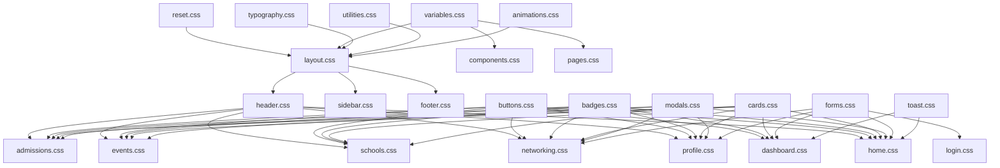

# CSS Migration Blueprint: CampusLink Modularization

This document outlines the step-by-step roadmap, dependency graph, component inventory, duplication cleanup plan, and safe migration order for refactoring [style.css](file:///e:/Owais/School%20Idea/SchoolIn/style.css) into a clean, modular CSS architecture.

---

## 1. Migration Roadmap by Module

This section details the target files, source ranges, dependencies, risk, and priority for every logical section identified in the stylesheet analysis.

### Core Architecture (Phase 1 - Extracted)
| Target CSS File | Source Section | Approx. Lines | Dependencies | Risk | Priority |
| :--- | :--- | :--- | :--- | :--- | :--- |
| **`css/core/reset.css`** | Reset blocks | 1 – 4 | None | Low | High |
| **`css/core/variables.css`** | CSS Variables | 1 – 4 | None | Low | High |
| **`css/core/typography.css`** | Typography defaults | 1 – 4 | `variables.css` | Low | High |
| **`css/core/utilities.css`** | Utility helper classes | 40 – 41 | `variables.css` | Low | High |
| **`css/core/animations.css`** | Global Keyframe animations | 5105-5108, 5667-5670, 7683-7686 | `variables.css` | Low | High |

---

### Layout Modules (Phase 2)
| Target CSS File | Source Section | Approx. Lines | Dependencies | Risk | Priority |
| :--- | :--- | :--- | :--- | :--- | :--- |
| **`css/layout/layout.css`** | Layout Containers, Global Mobile Foundation, Directory Page Mobile | 5–41, 9373–10117, 10693–11341 | `variables.css`, `reset.css` | Medium | High |
| **`css/layout/header.css`** | Header / Navigation, Nav User Pill & Avatar, Notification Bell Panel, Global Mobile Nav | 140–696, 4961–5035, 8556–8834, 12923–13107 | `variables.css`, `layout.css` | Medium | High |
| **`css/layout/sidebar.css`** | Dashboard Sidebar Layout | 5116–5194 | `variables.css`, `layout.css` | Low | High |
| **`css/layout/footer.css`** | Footer Styles, Global Mobile Footer | 1348–1494, 14607–14789 | `variables.css`, `layout.css` | Low | Medium |

#### Layout Module Details:
* **`css/layout/layout.css`**:
  * **Sections to move:** Layout Containers, Global Mobile Foundation, Directory Page Mobile.
  * **Source lines:** 5–41, 9373–10117, 10693–11341.
  * **Pages using:** All pages.
  * **Shared components required:** None.
  * **Dependencies:** `variables.css`, `reset.css`.
  * **Est. selectors:** ~150.
  * **Risk Level:** Medium.
  * **Migration Order:** 1.

* **`css/layout/header.css`**:
  * **Sections to move:** Header / Navigation, Nav User Pill & Avatar, Notification Bell Panel, Global Mobile Nav.
  * **Source lines:** 140–696, 4961–5035, 8556–8834, 12923–13107.
  * **Pages using:** All pages except login/admin.
  * **Shared components required:** None.
  * **Dependencies:** `variables.css`, `layout.css`.
  * **Est. selectors:** ~120.
  * **Risk Level:** Medium.
  * **Migration Order:** 2.

* **`css/layout/sidebar.css`**:
  * **Sections to move:** Dashboard Sidebar.
  * **Source lines:** 5116–5194.
  * **Pages using:** `dashboard.html`.
  * **Shared components required:** None.
  * **Dependencies:** `variables.css`, `layout.css`.
  * **Est. selectors:** ~15.
  * **Risk Level:** Low.
  * **Migration Order:** 3.

* **`css/layout/footer.css`**:
  * **Sections to move:** Footer Styles, Global Mobile Footer.
  * **Source lines:** 1348–1494, 14607–14789.
  * **Pages using:** All frontend user pages.
  * **Shared components required:** None.
  * **Dependencies:** `variables.css`, `layout.css`.
  * **Est. selectors:** ~25.
  * **Risk Level:** Low.
  * **Migration Order:** 4.

---

### Component Modules (Phase 3)
| Target CSS File | Source Section | Approx. Lines | Dependencies | Risk | Priority |
| :--- | :--- | :--- | :--- | :--- | :--- |
| **`css/components/buttons.css`** | Buttons, Post Interaction Animations | 42–116, 16223–16265 | `variables.css` | Low | High |
| **`css/components/badges.css`** | Badges & Chips, Role-Based Badges, User Type Badges, School Affiliation Badges | 117–139, 4843–4897, 5036–5070, 15780–15941 | `variables.css` | Low | High |
| **`css/components/cards.css`** | Table Cards, Suggested widgets card base | 5311–5359, 13131–13151 | `variables.css` | Low | Medium |
| **`css/components/modals.css`** | Modal Overlays, Wizard Modals, Mobile Sheets | 1495–1631, 1632–1951, 5387–5443, 13964–14302 | `variables.css` | High | High |
| **`css/components/forms.css`** | Forms, Banner Upload Dropzones, Avatar Upload, Mentions Autocomplete | 5510–5560, 3981–4842, 4898–4960, 12872–12922, 16413–16450 | `variables.css` | Medium | High |
| **`css/components/toast.css`** | Toast System, Toast Notifications | 3916–3956, 5444–5486 | `variables.css` | Low | Medium |

#### Component Module Details:
* **`css/components/buttons.css`**:
  * **Sections to move:** Buttons, Post Interaction Animations.
  * **Source lines:** 42–116, 16223–16265.
  * **Pages using:** All pages.
  * **Shared components required:** None.
  * **Dependencies:** `variables.css`.
  * **Est. selectors:** ~30.
  * **Risk Level:** Low.
  * **Migration Order:** 5.

* **`css/components/badges.css`**:
  * **Sections to move:** Badges & Chips, Role-Based Badges, User Type Badges, School Affiliation Badges.
  * **Source lines:** 117–139, 4843–4897, 5036–5070, 15780–15941.
  * **Pages using:** All pages.
  * **Shared components required:** None.
  * **Dependencies:** `variables.css`.
  * **Est. selectors:** ~60.
  * **Risk Level:** Low.
  * **Migration Order:** 6.

* **`css/components/cards.css`**:
  * **Sections to move:** Table Cards, Suggested widgets card base.
  * **Source lines:** 5311–5359, 13131–13151.
  * **Pages using:** `dashboard.html`, `networking.html`.
  * **Shared components required:** None.
  * **Dependencies:** `variables.css`.
  * **Est. selectors:** ~20.
  * **Risk Level:** Low.
  * **Migration Order:** 7.

* **`css/components/modals.css`**:
  * **Sections to move:** Registration Onboarding Modal, Event Registration Wizard Styling, Modal Overlay, Mobile Sheet & Overlays.
  * **Source lines:** 1495–1631, 1632–1951, 5387–5443, 13964–14302.
  * **Pages using:** `index.html`, `events.html`, `profile.html`, `school-profile.html`, `networking.html`.
  * **Shared components required:** None.
  * **Dependencies:** `variables.css`.
  * **Est. selectors:** ~120.
  * **Risk Level:** High (contains complex multi-step wizards).
  * **Migration Order:** 8.

* **`css/components/forms.css`**:
  * **Sections to move:** Form Styles (Modal Forms), Banner Upload Dropzone, Avatar Upload Styles, Post Dropdowns, Mentions Autocomplete.
  * **Source lines:** 5510–5560, 3981–4842, 4898–4960, 12872–12922, 16413–16450.
  * **Pages using:** `profile.html`, `school-profile.html`, `index.html`, `login.html`, `dashboard.html`.
  * **Shared components required:** None.
  * **Dependencies:** `variables.css`.
  * **Est. selectors:** ~150.
  * **Risk Level:** Medium.
  * **Migration Order:** 9.

* **`css/components/toast.css`**:
  * **Sections to move:** Toast Notification System, Toast Notifications.
  * **Source lines:** 3916–3956, 5444–5486.
  * **Pages using:** All pages.
  * **Shared components required:** None.
  * **Dependencies:** `variables.css`.
  * **Est. selectors:** ~20.
  * **Risk Level:** Low.
  * **Migration Order:** 10.

---

### Page-Specific Modules (Phase 4)
| Target CSS File | Source Section | Approx. Lines | Dependencies | Risk | Priority |
| :--- | :--- | :--- | :--- | :--- | :--- |
| **`css/pages/home.css`** | Hero, Features, Showcase Slider, Stats, Steps, CTA, Social Feed, Mobile Feed Redesigns, Posting System | 697–1347, 6577–7836, 11607–12033, 12034–12871, 16152–16222 | `layout.css`, `header.css`, `footer.css`, `buttons.css`, `cards.css`, `badges.css`, `modals.css`, `forms.css`, `toast.css` | High | High |
| **`css/pages/schools.css`** | Schools Page Styles | 2111–2341 | `layout.css`, `header.css`, `footer.css`, `buttons.css`, `badges.css` | Medium | Medium |
| **`css/pages/school-profile.css`**| School Profile Page Styles, School Profile Redesign V2 | 2342–2665, 16266–16358 | `layout.css`, `header.css`, `footer.css`, `buttons.css`, `badges.css`, `forms.css` | Medium | Medium |
| **`css/pages/events.css`** | Events Page Styles, Modern Event Cards | 2666–2776, 16359–16412 | `layout.css`, `header.css`, `footer.css`, `buttons.css`, `badges.css` | Medium | Medium |
| **`css/pages/event-detail.css`** | Event Detail Page Styles | 3192–3408 | `layout.css`, `header.css`, `footer.css`, `buttons.css`, `badges.css` | Medium | Medium |
| **`css/pages/admissions.css`** | Admissions Page Styles | 2777–2856 | `layout.css`, `header.css`, `footer.css`, `buttons.css`, `badges.css` | Medium | Medium |
| **`css/pages/apply-admission.css`**| Admission Workflow Details, Step Progress bar | 11235–11327 | `layout.css`, `header.css`, `footer.css`, `buttons.css`, `forms.css` | Medium | Medium |
| **`css/pages/networking.css`** | Networking Page Styles, Redesigned Networking, Mobile Networking, Suggestions cards | 7837–8555, 13108–13963, 14303–14860, 14861–15042, 15942–16151 | `layout.css`, `header.css`, `footer.css`, `buttons.css`, `cards.css`, `badges.css`, `modals.css`, `forms.css` | High | High |
| **`css/pages/profile.css`** | Student Profile Page, Profile Redesign V2, Activity Pulse & Mobile UI Redesign, Affiliation Badge | 5632–6576, 15043–15119, 15120–15779, 15920–15941 | `layout.css`, `header.css`, `footer.css`, `buttons.css`, `cards.css`, `badges.css`, `modals.css`, `forms.css` | High | High |
| **`css/pages/login.css`** | Auth Loading, Auth Mobile Optimization | 5071–5108, 10118–10692 | `layout.css`, `buttons.css`, `forms.css` | Medium | Medium |
| **`css/pages/dashboard.css`** | School Admin Dashboard Styles, Stats Grid, Tables, Action buttons, Forms inside Dashboard, Dashboard layouts | 2857–3191, 3409–3915, 3957–3980, 5109–5631 | `layout.css`, `sidebar.css`, `buttons.css`, `cards.css`, `badges.css`, `forms.css`, `toast.css` | High | High |

#### Page-Specific Module Details:
* **`css/pages/home.css`**:
  * **Sections to move:** Hero, Features, Showcase Slider, Stats, Steps, CTA, Social Feed, Mobile Feed Redesigns, Posting System.
  * **Source lines:** 697–1347, 6577–7836, 11607–12033, 12034–12871, 16152–16222.
  * **Pages using:** `index.html`.
  * **Shared components required:** `buttons`, `cards`, `badges`, `modals`, `forms`, `toast`.
  * **Dependencies:** `layout.css`, `header.css`, `footer.css`.
  * **Est. selectors:** ~450.
  * **Risk Level:** High (contains the highly interactive feed and showcase).
  * **Migration Order:** 11.

* **`css/pages/schools.css`**:
  * **Sections to move:** Schools Page Styles.
  * **Source lines:** 2111–2341.
  * **Pages using:** `schools.html`.
  * **Shared components required:** `buttons`, `badges`.
  * **Dependencies:** `layout.css`, `header.css`, `footer.css`.
  * **Est. selectors:** ~35.
  * **Risk Level:** Medium.
  * **Migration Order:** 12.

* **`css/pages/school-profile.css`**:
  * **Sections to move:** School Profile Page Styles, School Profile Redesign V2.
  * **Source lines:** 2342–2665, 16266–16358.
  * **Pages using:** `school-profile.html`.
  * **Shared components required:** `buttons`, `badges`, `forms`.
  * **Dependencies:** `layout.css`, `header.css`, `footer.css`.
  * **Est. selectors:** ~65.
  * **Risk Level:** Medium.
  * **Migration Order:** 13.

* **`css/pages/events.css`**:
  * **Sections to move:** Events Page Styles, Modern Event Cards.
  * **Source lines:** 2666–2776, 16359–16412.
  * **Pages using:** `events.html`.
  * **Shared components required:** `buttons`, `badges`.
  * **Dependencies:** `layout.css`, `header.css`, `footer.css`.
  * **Est. selectors:** ~30.
  * **Risk Level:** Medium.
  * **Migration Order:** 14.

* **`css/pages/event-detail.css`**:
  * **Sections to move:** Event Detail Page Styles.
  * **Source lines:** 3192–3408.
  * **Pages using:** `event-detail.html`.
  * **Shared components required:** `buttons`, `badges`.
  * **Dependencies:** `layout.css`, `header.css`, `footer.css`.
  * **Est. selectors:** ~30.
  * **Risk Level:** Medium.
  * **Migration Order:** 15.

* **`css/pages/admissions.css`**:
  * **Sections to move:** Admissions Page Styles.
  * **Source lines:** 2777–2856.
  * **Pages using:** `admissions.html`.
  * **Shared components required:** `buttons`, `badges`.
  * **Dependencies:** `layout.css`, `header.css`, `footer.css`.
  * **Est. selectors:** ~15.
  * **Risk Level:** Medium.
  * **Migration Order:** 16.

* **`css/pages/apply-admission.css`**:
  * **Sections to move:** Admission Workflow Details, Step Progress bar.
  * **Source lines:** 11235–11327.
  * **Pages using:** `apply-admission.html`.
  * **Shared components required:** `buttons`, `forms`.
  * **Dependencies:** `layout.css`, `header.css`, `footer.css`.
  * **Est. selectors:** ~20.
  * **Risk Level:** Medium.
  * **Migration Order:** 17.

* **`css/pages/networking.css`**:
  * **Sections to move:** Networking Page Styles, Redesigned Networking, Mobile Networking, Suggestions cards, Smart Connections.
  * **Source lines:** 7837–8555, 13108–13963, 14303–14860, 14861–15042, 15942–16151.
  * **Pages using:** `networking.html`.
  * **Shared components required:** `buttons`, `cards`, `badges`, `modals`, `forms`.
  * **Dependencies:** `layout.css`, `header.css`, `footer.css`.
  * **Est. selectors:** ~250.
  * **Risk Level:** High.
  * **Migration Order:** 18.

* **`css/pages/profile.css`**:
  * **Sections to move:** Student Profile Page, Profile Redesign V2, Activity Pulse & Mobile UI Redesign, Affiliation Badge.
  * **Source lines:** 5632–6576, 15043–15119, 15120–15779, 15920–15941.
  * **Pages using:** `profile.html`.
  * **Shared components required:** `buttons`, `cards`, `badges`, `modals`, `forms`.
  * **Dependencies:** `layout.css`, `header.css`, `footer.css`.
  * **Est. selectors:** ~180.
  * **Risk Level:** High.
  * **Migration Order:** 19.

* **`css/pages/login.css`**:
  * **Sections to move:** Auth Loading, Auth Mobile Optimization.
  * **Source lines:** 5071–5108, 10118–10692.
  * **Pages using:** `login.html`, `complete-profile.html`.
  * **Shared components required:** `buttons`, `forms`.
  * **Dependencies:** `layout.css`.
  * **Est. selectors:** ~80.
  * **Risk Level:** Medium.
  * **Migration Order:** 20.

* **`css/pages/dashboard.css`**:
  * **Sections to move:** School Admin Dashboard Styles, Stats Grid, Tables, Action buttons, Forms inside Dashboard, Dashboard layouts.
  * **Source lines:** 2857–3191, 3409–3915, 3957–3980, 5109–5631.
  * **Pages using:** `dashboard.html`.
  * **Shared components required:** `buttons`, `cards`, `badges`, `forms`, `toast`.
  * **Dependencies:** `layout.css`, `sidebar.css`.
  * **Est. selectors:** ~350.
  * **Risk Level:** High (primary dashboard logic relies heavily on layout structures).
  * **Migration Order:** 21.

---

## 2. Dependency Graph

The dependency relationships between core files, layouts, shared components, and page-specific stylesheets are structured as follows:

---

## 3. Shared Components Inventory

Below is an inventory of reusable UI components and the directories / files where they are consumed.

### **Buttons (`css/components/buttons.css`)**
* **Used by:**
  * Landing Feed (`index.html`)
  * Student Profile (`profile.html`)
  * School Profile (`school-profile.html`)
  * Schools Directory (`schools.html`)
  * Events Listings & Details (`events.html`, `event-detail.html`)
  * Admissions Portal & Apply (`admissions.html`, `apply-admission.html`)
  * Connection Hub (`networking.html`)
  * Authentication screens (`login.html`, `complete-profile.html`)
  * School Admin Dashboard (`dashboard.html`)

### **Badges (`css/components/badges.css`)**
* **Used by:**
  * Landing Feed (`index.html` - official tags)
  * Student Profile (`profile.html` - user type & verified badge)
  * School Profile (`school-profile.html` - gold verified badges)
  * Schools Directory (`schools.html` - affiliation tags)
  * Events Listings (`events.html` - upcoming status badge)
  * Admissions Listings (`admissions.html` - admission status badge)
  * Connection Hub (`networking.html` - role indicators)
  * Admin Dashboard (`dashboard.html` - table application status badges)

### **Cards (`css/components/cards.css`)**
* **Used by:**
  * Student Profile (`profile.html` - certificates, school sidebar cards)
  * Connection Hub (`networking.html` - manage network card, invitation items)
  * Admin Dashboard (`dashboard.html` - statistics metric cards, grid wraps)

### **Modals & Overlays (`css/components/modals.css`)**
* **Used by:**
  * Landing Feed (`index.html` - multistep role onboarding)
  * Student Profile (`profile.html` - edit profile modal, credentials popup)
  * School Profile (`school-profile.html` - edit school properties modal)
  * Events Listings (`events.html` - event registration wizard)
  * Connection Hub (`networking.html` - bottom sheets, search overlays)
  * Admin Dashboard (`dashboard.html` - edit popup overlays)

### **Forms (`css/components/forms.css`)**
* **Used by:**
  * Student Profile (`profile.html` - credentials, strength edits)
  * Landing Feed (`index.html` - composer Share Box textareas, mentions autocomplete)
  * Admin Dashboard (`dashboard.html` - banner dropzones, avatar upload forms)
  * Admissions Apply (`apply-admission.html` - application inputs)
  * Authentication screen (`login.html` - password toggle forms)

### **Toast System (`css/components/toast.css`)**
* **Used by:**
  * All pages (injected dynamically via `app.js` and `dashboard.js` logic)

---

## 4. Duplicate Cleanup Plan

This plan outlines the action items for resolving duplicates identified in the analysis report without removing style functionality.

| Selector | Occurrences | Likely Active Version | Recommended Action |
| :--- | :--- | :--- | :--- |
| **`@keyframes spin`** | Lines 5105, 5667, 7683 | Line 5105 (layout/animations) | Consolidate to `css/core/animations.css`. Remove duplicates from page files. |
| **`.spinner`** | Lines 5590, 5657, 7673 | Line 5590 | Define once in `css/components/badges.css` or `css/core/utilities.css`. Remove others. |
| **`.verified-badge-lg/md/sm`**| Lines 5866–5879, 15886–15891 | Lines 5866–5879 | Define once in `css/components/badges.css`. Delete duplicates from lines 15886–15891. |
| **`.feed-container`** | Lines 6580, 7831, 11162, 12208 | Line 6580 (base layout) | Merge overrides into `css/pages/home.css` inside relevant media queries. |
| **`.profile-sidebar-card`** | Lines 6110, 6610 | Lines 6110 and 6610 (different uses) | Keep separate but rename one to prevent layout conflicts, or merge properties into `css/components/cards.css`. |
| **`.net-card`** | Lines 8011, 14877 | Line 8011 | Consolidate base in `css/pages/networking.css` and structure overrides. |
| **`.connection-request-avatar`**| Lines 8496, 15720 | Line 8496 | Merge into `css/components/badges.css` or `css/pages/networking.css`. |
| **`.notif-panel`** | Lines 8619, 11361 | Line 8619 | Merge responsive overrides into `css/layout/header.css` media queries. |
| **`header`** | Lines 9441, 12065, 15135 | Line 140 (base header) | Merge responsive overrides into `css/layout/header.css`. |
| **`.suggested-school-card`** | Lines 13547, 14468 | Line 13547 | Consolidate into `css/pages/networking.css`. |
| **`.net-person-card`** | Lines 13662, 14304 | Line 13662 | Consolidate into `css/pages/networking.css`. |
| **Profile actions (`#connect-profile-btn`, etc.)** | Lines 15420–15443, 15615–15638 | Lines 15420–15443 | Delete the exact duplicate lines 15615–15638. |

---

## 5. Responsive Strategy

To avoid layout regressions on mobile or tablet screen widths, layout responsiveness will follow a co-located approach.

### 1. Global Responsive Layouts (`css/layout/layout.css`)
* **What lives here:** Base viewport rules (`html`, `body` overflow resets), container widths (`.container` max-widths), grid columns collapses for generic layouts, page layouts, and global safe area offsets.
* **Breakpoints:** `@media (max-width: 1024px)`, `@media (max-width: 768px)`, and `@media (max-width: 480px)`.

### 2. Header & Navigation Responsiveness (`css/layout/header.css`)
* **What lives here:** Global mobile navigation bar collapse rules, floating bottom navigation pill (`.global-mobile-nav`), slide-out hamburger menu sheets, and mobile dropdown panels.

### 3. Component Responsiveness (`css/components/`)
* Button pad resizing, modal width adjustments (`.modal-large` scaling), and form inputs columns stacking live inside their respective component files (`buttons.css`, `modals.css`, `forms.css`).

### 4. Page-Specific Responsiveness (`css/pages/`)
* All custom media queries that belong to a single page (such as the feed composer grid layout or networking results grid collapses) must live within the page's stylesheet (e.g., `@media` blocks in `home.css`, `networking.css`, and `profile.css`). This maintains clean code cohesion.

---

## 6. Safe Phased Migration Order

> [!IMPORTANT]
> The migration process is broken down into safe, testable phases. After each phase, the stylesheet inclusion in HTML heads MUST be updated in both root files (for Vercel) and `www/` files (for Capacitor) simultaneously.

### Phase 1: Global Layouts & Footer
* **Files affected:**
  * Create `css/layout/layout.css`
  * Create `css/layout/footer.css`
  * Modify [style.css](file:///e:/Owais/School%20Idea/SchoolIn/style.css) (Delete Layout and Footer sections)
* **Pages affected:** All pages.
* **Expected Visual Impact:** None. Page layout grid structures and footers must look identical.
* **Rollback Instructions:** Revert [style.css](file:///e:/Owais/School%20Idea/SchoolIn/style.css) to commit state; delete layout/footer CSS files.
* **Git Commit Message:** `chore(css): extract global layouts and footer to layout.css and footer.css`

---

### Phase 2: Navigation & Header
* **Files affected:**
  * Create `css/layout/header.css`
  * Modify [style.css](file:///e:/Owais/School%20Idea/SchoolIn/style.css) (Delete Header and Navigation blocks)
* **Pages affected:** All pages (except Admin Dashboard and Login).
* **Expected Visual Impact:** Navigation header, notification bell panel, and dark navy bottom nav pill must remain intact.
* **Rollback Instructions:** Revert [style.css](file:///e:/Owais/School%20Idea/SchoolIn/style.css) to commit state; delete header.css.
* **Git Commit Message:** `chore(css): extract global navigation and notification panel to header.css`

---

### Phase 3: Shared Components (Buttons, Badges, Cards, Toast)
* **Files affected:**
  * Create `css/components/buttons.css`
  * Create `css/components/badges.css`
  * Create `css/components/cards.css`
  * Create `css/components/toast.css`
  * Modify [style.css](file:///e:/Owais/School%20Idea/SchoolIn/style.css) (Delete Buttons, Badges, Cards, and Toast sections)
* **Pages affected:** All pages.
* **Expected Visual Impact:** None. Buttons hover, chips, and toast triggers must function normally.
* **Rollback Instructions:** Revert [style.css](file:///e:/Owais/School%20Idea/SchoolIn/style.css) to commit state; delete components CSS files.
* **Git Commit Message:** `chore(css): extract buttons, badges, cards, and toast styles to components/`

---

### Phase 4: Forms & Modals
* **Files affected:**
  * Create `css/components/forms.css`
  * Create `css/components/modals.css`
  * Modify [style.css](file:///e:/Owais/School%20Idea/SchoolIn/style.css) (Delete onboarding modals, dropzones, dropdowns, and form sheets)
* **Pages affected:** All pages.
* **Expected Visual Impact:** Onboarding wizard, event modal dropdowns, file uploads dropzones must show identical layouts.
* **Rollback Instructions:** Revert [style.css](file:///e:/Owais/School%20Idea/SchoolIn/style.css) to commit state; delete forms/modals CSS.
* **Git Commit Message:** `chore(css): extract form inputs, autocomplete, and modal layouts to components/`

---

### Phase 5: Landing Feed & School Posting Page
* **Files affected:**
  * Create `css/pages/home.css`
  * Modify [style.css](file:///e:/Owais/School%20Idea/SchoolIn/style.css) (Delete Hero, Features, Showcase Slider, Social Feed sections)
* **Pages affected:** Landing Page / Feed (`index.html`).
* **Expected Visual Impact:** Showcase slider layout, composer box, reactions and mobile feed structure must remain identical.
* **Rollback Instructions:** Revert [style.css](file:///e:/Owais/School%20Idea/SchoolIn/style.css); delete home.css.
* **Git Commit Message:** `chore(css): extract landing page and social feed styles to home.css`

---

### Phase 6: Student Profile & Networking Hub
* **Files affected:**
  * Create `css/pages/profile.css`
  * Create `css/pages/networking.css`
  * Modify [style.css](file:///e:/Owais/School%20Idea/SchoolIn/style.css) (Delete profile, networking, suggestions, and smart connections)
* **Pages affected:** `profile.html`, `networking.html`.
* **Expected Visual Impact:** User profiles timeline, connections request lists, networking search grids must remain intact.
* **Rollback Instructions:** Revert [style.css](file:///e:/Owais/School%20Idea/SchoolIn/style.css); delete profile/networking CSS.
* **Git Commit Message:** `chore(css): extract student profile and connection hub styles`

---

### Phase 7: Directories (Schools, Events, Admissions)
* **Files affected:**
  * Create `css/pages/schools.css`
  * Create `css/pages/school-profile.css`
  * Create `css/pages/events.css`
  * Create `css/pages/event-detail.css`
  * Create `css/pages/admissions.css`
  * Create `css/pages/apply-admission.css`
  * Modify [style.css](file:///e:/Owais/School%20Idea/SchoolIn/style.css) (Delete directories style blocks)
* **Pages affected:** `schools.html`, `school-profile.html`, `events.html`, `event-detail.html`, `admissions.html`, `apply-admission.html`.
* **Expected Visual Impact:** Directories map layouts, event detail timetables, admission forms progress bars must match original.
* **Rollback Instructions:** Revert [style.css](file:///e:/Owais/School%20Idea/SchoolIn/style.css); delete page directories CSS.
* **Git Commit Message:** `chore(css): extract school, event, and admission page styles`

---

### Phase 8: Auth & Admin Dashboard Workspace
* **Files affected:**
  * Create `css/pages/login.css`
  * Create `css/pages/dashboard.css`
  * Create `css/layout/sidebar.css`
  * Modify [style.css](file:///e:/Owais/School%20Idea/SchoolIn/style.css) (Delete dashboard CSS, tables grid, auth overlays)
* **Pages affected:** `login.html`, `complete-profile.html`, `dashboard.html`.
* **Expected Visual Impact:** Admin panel layout, sidebar toggle, stats grids, and login screens must function normally.
* **Rollback Instructions:** Revert [style.css](file:///e:/Owais/School%20Idea/SchoolIn/style.css); delete remaining CSS files.
* **Git Commit Message:** `chore(css): extract auth and dashboard stylesheets. Complete refactor`
