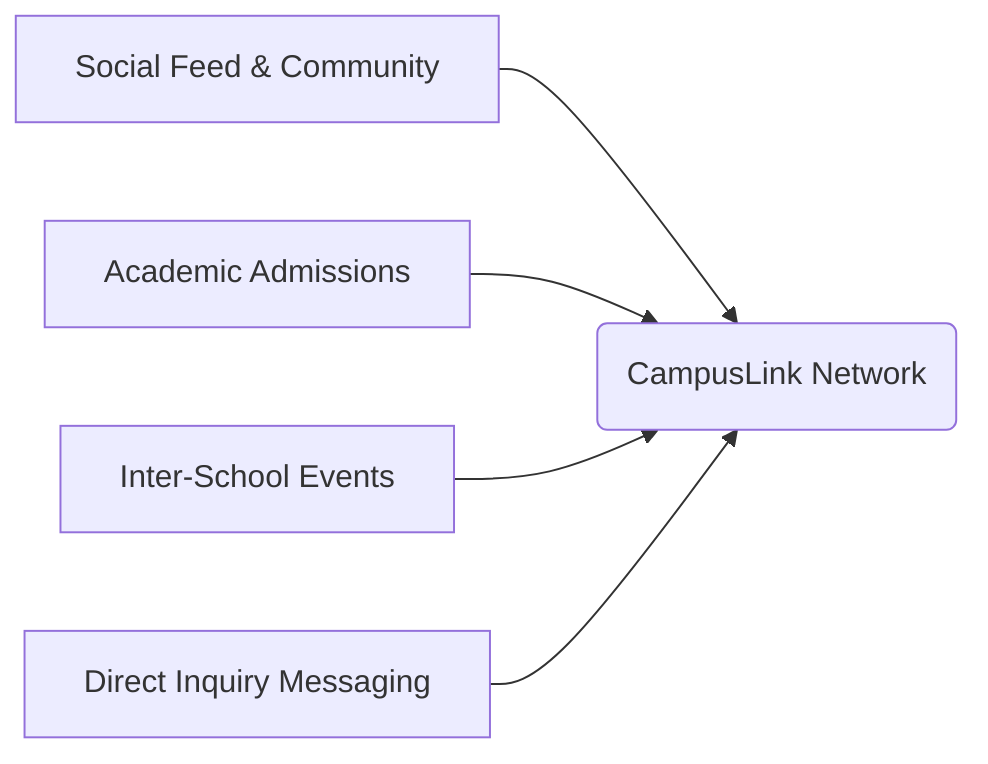

# CampusLink Documentation Hub

Welcome to the engineering handbook and product documentation hub for **CampusLink** — India's premier role-based school networking platform. This documentation system is the single source of truth for CampusLink's architecture, database schemas, APIs, features, and user interface systems.

---

## 1. Overview & Vision

CampusLink is designed to bridge the communication and collaboration gap in India's K-12 education ecosystem. It connects **students**, **teachers**, **parents**, **alumni**, and **school representatives** in a unified, role-based network.

### Product Pillars



* **School Identity**: Schools can claim pages, customize branding, showcase events, and manage rosters.
* **Academic Admissions**: Seamless search and submission of admission applications directly to partner schools.
* **Inter-School Events**: Centralized calendar of school fests, science exhibits, and sports competitions with automated registrations.
* **Networking & Mutual Connections**: LinkedIn-style connection requests and following feeds for academic growth.

---

## 2. Folder Structure

The following tree represents the layout of the project root and static assets:

```text
SchoolIn/ (Project Root)
├── admin/                     # Platform Super Admin Dashboard
│   ├── index.html             # Super Admin control panel HTML
│   └── admin.js               # Super Admin control panel JS logic
├── android/                   # Capacitor Android Project files
├── docs/                      # Project Documentation (Single source of truth)
│   ├── features/              # Individual feature specs and requirements
│   ├── ui/                    # Design tokens and interface guides
│   └── decisions/             # Architecture Decision Records (ADRs)
├── scratch/                   # Developer scratchpads & test scripts
├── supabase/                  # Supabase Edge Functions configurations
├── www/                       # Static resource web assets
├── *.html                     # Core HTML files (dashboard, admissions, profile, etc.)
├── *.js                       # Client-side JavaScript logic (auth.js, app.js, messaging.js)
├── *.css                      # Page stylesheets (style.css, messaging.css, events.css)
└── *.sql                      # SQL database schema and migration scripts
```

---

## 3. Technology Stack

CampusLink uses a serverless, hybrid technology stack optimized for high performance, portability, and database-level security:

| Tier | Technology | Description |
| :--- | :--- | :--- |
| **Frontend Core** | Vanilla HTML5 & CSS3 | Semantic markup, dynamic CSS variables, custom grid layouts, and transitions. |
| **Frontend Logic** | Vanilla ES6 JavaScript | Modular, page-specific scripting utilizing the Supabase JS SDK. |
| **Database & API** | PostgreSQL (Supabase) | Relational tables, indexes, and triggers running directly in a serverless setup. |
| **Security Layer** | Row-Level Security (RLS) | Enforces authentication check-rules on select, insert, and update queries. |
| **File Storage** | Supabase Storage | Managed buckets for avatars, school logos, and covers. |
| **Realtime Sync** | Supabase Realtime Channels | WebSocket subscription layer for instant message routing. |
| **Mobile Port** | Capacitor CLI (Android) | WebView wrapper packaging web assets into native mobile applications. |

---

## 4. Quick Start

Follow these steps to run a local development environment:

### Prerequisites
* Install [Node.js](https://nodejs.org/) (which includes `npm`).

### Installation
1. Clone the repository:
   ```bash
   git clone https://github.com/owaissaifi019-debug/Schoolin.git
   cd Schoolin
   ```
2. Install Capacitor and package CLI tools:
   ```bash
   npm install
   ```

### Running Locally
To launch a hot-reloading development server:
```bash
npm run dev
```
Open [http://localhost:3000](http://localhost:3000) in your web browser.

---

## 5. Development Workflow

1. **Local Development**: Edit files inside the root directory. Style rules are updated directly inside CSS files.
2. **Database Schema updates**: When introducing database changes, write an SQL migration file and run it in your Supabase SQL Editor.
3. **Android Compilation**: Synchronize build assets with the Capacitor wrapper:
   ```bash
   npx cap sync
   npx cap open android
   ```

---

## 6. Documentation Index

Use the links below to navigate the CampusLink engineering handbook:

| Category | Document Link | Description |
| :--- | :--- | :--- |
| **Core Documentation** | [architecture.md](architecture.md) | In-depth layout of frontend, backend, and role structures. |
| | [database.md](database.md) | Table structures, column descriptions, and ER diagrams. |
| | [api.md](api.md) | Direct frontend-backend Javascript SDK query methods. |
| | [roadmap.md](roadmap.md) | Completion trackers and upcoming development goals. |
| | [deployment.md](deployment.md) | Detailed walkthrough of Vercel and Supabase deployments. |
| | [coding-standards.md](coding-standards.md) | Coding style rules and commit guidelines. |
| | [ui-guidelines.md](ui-guidelines.md) | Core visual design standards and principles. |
| **User Interface** | [ui/design-system.md](ui/design-system.md) | Color swatches, gradients, shadows, and radii tokens. |
| | [ui/typography.md](ui/typography.md) | Plus Jakarta Sans styling scale. |
| | [ui/components.md](ui/components.md) | Buttons, inputs, modals, alerts, and loaders. |
| | [ui/responsive-guidelines.md](ui/responsive-guidelines.md) | Breakpoints and mobile layout transitions. |
| **Features** | [features/authentication.md](features/authentication.md) | User signUp, signIn, and profile creation triggers. |
| | [features/dashboard.md](features/dashboard.md) | Main dashboard feeds, search chips, and filters. |
| | [features/school-profile.md](features/school-profile.md) | Branding pages, logo uploads, and verified rosters. |
| | [features/admissions.md](features/admissions.md) | Open admissions directory and application submission. |
| | [features/events.md](features/events.md) | Tournament calendar entries and event registrations. |
| | [features/community.md](features/community.md) | Comments, likes, mentions autocomplete, and reports. |
| | [features/messaging.md](features/messaging.md) | Chat threads and WebSocket messages. |
| | [features/networking.md](features/networking.md) | Connections request pipelines and user follows. |
| | [features/notifications.md](features/notifications.md) | Counts and dropdown notifications. |
| | [features/settings.md](features/settings.md) | Portfolio customization and account deletion. |
| | [features/classroom-management.md](features/classroom-management.md) | *In Progress* Classroom setups and capacities. |
| | [features/academic-years.md](features/academic-years.md) | *In Progress* Session transitions. |
| | [features/teacher-management.md](features/teacher-management.md) | *In Progress* Subject teacher allocations. |
| | [features/student-management.md](features/student-management.md) | *In Progress* Class roll configurations. |
| **Decision Logs** | [decisions/ADR-001-role-system.md](decisions/ADR-001-role-system.md) | Architecture choice for role-based authorizations. |
| | [decisions/ADR-002-school-posting.md](decisions/ADR-002-school-posting.md) | Posting permission database triggers. |
| | [decisions/ADR-003-classroom-architecture.md](decisions/ADR-003-classroom-architecture.md) | Decoupling of legacy Classroom workspace views. |
| | [decisions/ADR-004-parent-portal.md](decisions/ADR-004-parent-portal.md) | Architectural layout of the planned Parent Portal. |
