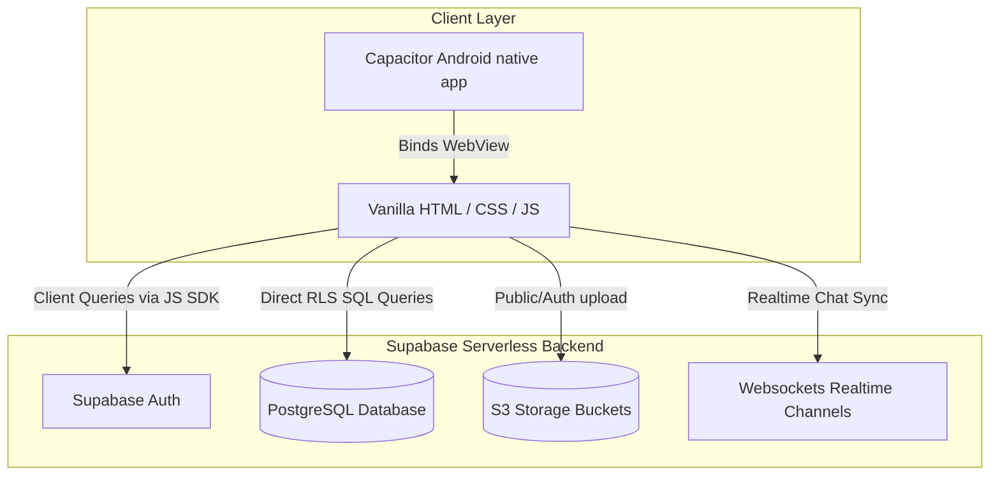
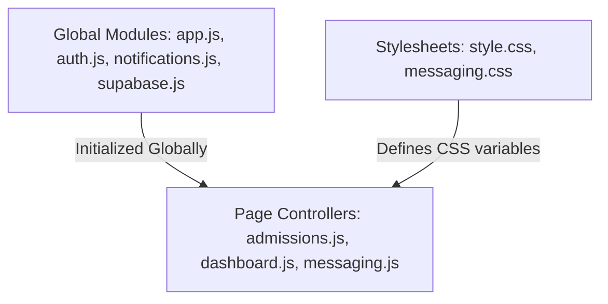
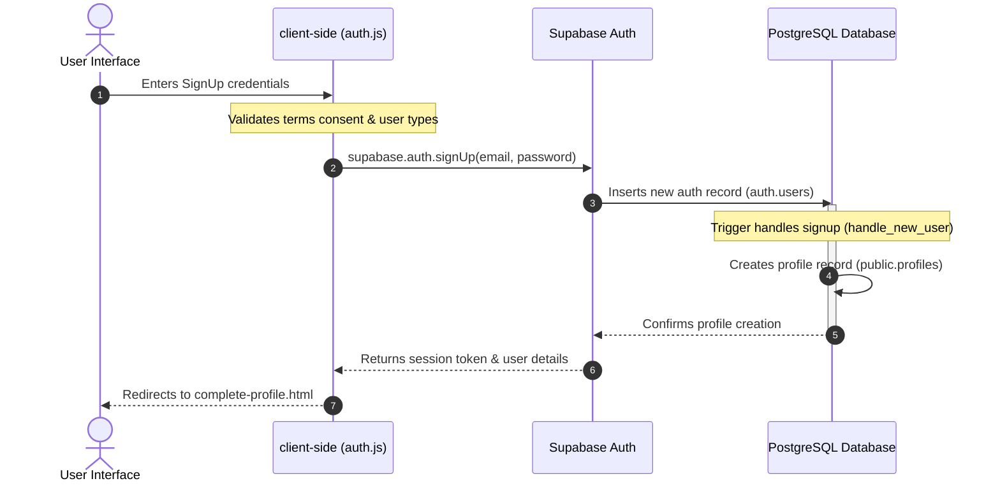
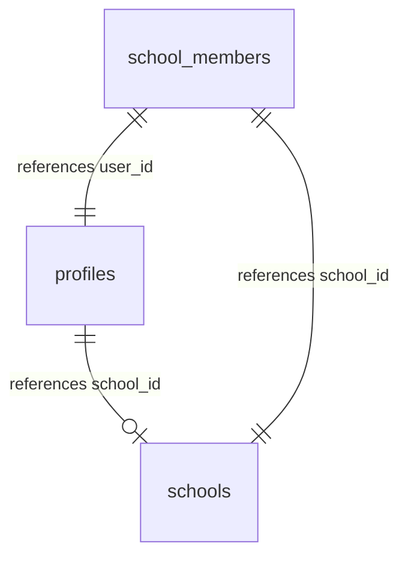

# System Architecture

This document describes the design patterns, system integrations, and data flows of the CampusLink application.

---

## 1. High-Level Architecture

CampusLink is designed as a **Serverless Hybrid Web/Mobile Application**. The application logic runs on the client, communicating directly with a serverless backend database layer.

---

## 2. Folder Structure & Roles

The codebase splits responsibilities between frontend layout files and database configurations:

* **Presentation Layer (HTML)**: Pages like `dashboard.html` and `admissions.html` represent views. Layout styling is defined in vanilla CSS stylesheets (`style.css`, `messaging.css`, etc.).
* **Controller Layer (JavaScript)**: JavaScript scripts (e.g. `dashboard.js`, `messaging.js`) handle user inputs and call database APIs.
* **Security & Database Layer (Supabase/PostgreSQL)**: SQL schemas enforce validation rules and block invalid operations directly inside the database, ensuring safety regardless of client alterations.

---

## 3. Frontend Architecture

The frontend is a single-page-centric layout written in vanilla JavaScript without heavy compile frameworks:

* **Global Script Isolation**: Helper modules (`app.js`, `auth.js`) attach functions to `window.CampusLink` to share state without polluting the global window space.
* **Client SDK Initialization**: The global namespace `window.CampusLink.supabase` is shared across all scripts, removing the need to re-initialize client instances on every page transition.
* **Component Styling**: Styled using vanilla CSS variables, allowing page controllers to change color schemes and themes dynamically by swapping simple classes on parent nodes.

---

## 4. Backend Architecture

The backend database runs on PostgreSQL. Access is managed by Row-Level Security (RLS) policies:

* **Authentication API**: Managed directly by Supabase Auth, returning a JSON Web Token (JWT) on successful verification.
* **Row-Level Security (RLS)**: Enforces access rules using SQL policy rules (e.g., checking if `auth.uid() = applicant_user_id` before returning rows).
* **Database Triggers & Functions**: Runs triggers (like profile syncing) as a `SECURITY DEFINER` to bypass RLS limits during automated operations.

---

## 5. Authentication & Signup Flow

The sequence diagram below displays the user registration pipeline:

---

## 6. Role-Based Permissions & Hierarchies

### Platform Roles (Column `profiles.platform_role`)
The application defines three platform roles:

| Platform Role | RLS Access | Capabilities |
| :--- | :--- | :--- |
| **Member** (`user`) | Restricted | Can browse school lists, apply for admissions, participate in events, and post personal achievements. |
| **School Admin** (`school_admin`) | School-Scoped | Can manage school details, events, admissions, school member directories, and approve admission applications. |
| **Super Admin** (`super_admin`) | Global (RLS Bypass) | Can resolve content reports, approve/reject schools, update platform roles, and delete any content. |

---

## 7. School Hierarchy & Data Sync

* **School Members**: Maps verified users to their respective school (using roles like `student`, `teacher`, `alumni`, etc.).
* **Sync Triggers**:
  * **On Member Insertion**: The trigger `tr_sync_school_member_insert` runs after a row is added to `school_members`. It updates the user's profile, setting `profiles.school_id = school_members.school_id` automatically.
  * **On Member Deletion**: The trigger `tr_sync_school_member_delete` runs after a member is deleted, setting `profiles.school_id = NULL`.
