# Database Schema Documentation

This document describes all tables, fields, relationships, constraints, and Row-Level Security (RLS) policies implemented in the CampusLink database.

---

## 1. Entity-Relationship (ER) Diagram

```mermaid
erDiagram
    profiles ||--o| schools : "school_id"
    schools ||--o| auth_users : "admin_user_id"
    profiles ||--|| auth_users : "id"
    school_members ||--|| schools : "school_id"
    school_members ||--|| profiles : "user_id"
    posts ||--|| profiles : "user_id"
    posts ||--o| schools : "school_id"
    post_likes ||--|| posts : "post_id"
    post_likes ||--|| profiles : "user_id"
    comments ||--|| posts : "post_id"
    comments ||--|| profiles : "user_id"
    follows ||--|| profiles : "follower_id"
    follows ||--o| profiles : "following_id"
    follows ||--o| schools : "following_school_id"
    connections ||--|| profiles : "requester_id"
    connections ||--|| profiles : "receiver_id"
    conversations ||--|| profiles : "initiator_id"
    conversations ||--o| schools : "school_id"
    conversation_participants ||--|| conversations : "conversation_id"
    conversation_participants ||--o| profiles : "user_id"
    conversation_participants ||--o| schools : "school_id"
    messages ||--|| conversations : "conversation_id"
    messages ||--|| profiles : "sender_id"
    messages ||--o| profiles : "receiver_id"
    messages ||--o| schools : "receiver_school_id"
    notifications ||--|| profiles : "user_id"
    notifications ||--o| profiles : "actor_id"
    post_reports ||--|| profiles : "reporter_id"
    post_reports ||--o| profiles : "post_author_id"
    mentions ||--|| posts : "post_id"
    mentions ||--|| comments : "comment_id"
    mentions ||--o| profiles : "mentioned_user_id"
    mentions ||--o| schools : "mentioned_school_id"
    mentions ||--|| profiles : "mentioned_by"
    admission_applications ||--|| schools : "school_id"
    admission_applications ||--o| profiles : "applicant_user_id"
    event_registrations ||--|| events : "event_id"
    event_registrations ||--|| schools : "school_id"
    event_registrations ||--o| profiles : "student_id"
    classrooms ||--|| schools : "school_id"
    classrooms ||--|| academic_years : "academic_year_id"
    classroom_teacher_assignments ||--|| classrooms : "classroom_id"
    classroom_teacher_assignments ||--|| profiles : "teacher_id"
    classroom_subject_teachers ||--|| classrooms : "classroom_id"
    classroom_subject_teachers ||--|| profiles : "teacher_id"
    classroom_students ||--|| classrooms : "classroom_id"
    classroom_students ||--|| profiles : "student_id"
```

---

## 2. Table Schemas

### Table: `profiles`
* **Purpose**: Extends default Supabase Auth details with academic portfolios and platform roles.
* **Used By**: Authentication, Social Feed, Networking, Profile view.

| Column | Type | Constraints | Description |
| :--- | :--- | :--- | :--- |
| `id` | `uuid` | `PRIMARY KEY`, `REFERENCES auth.users(id)` | Unique identifier. Matches auth credentials. |
| `full_name` | `text` | `NOT NULL`, Default `''` | User's full name. |
| `email` | `text` | None | User's email address. |
| `user_type` | `text` | `CHECK (user_type IN ('student', 'teacher', 'parent', 'alumni', 'school_representative'))` | User's role inside the school ecosystem. |
| `platform_role`| `text` | `CHECK (platform_role IN ('user', 'school_admin', 'super_admin'))` | Administrative permissions. |
| `school_id` | `uuid` | `REFERENCES public.schools(id)` | Associated school page link. |
| `avatar_url` | `text` | None | URL of the profile avatar image. |
| `bio` | `text` | None | Brief biography. |
| `class` | `text` | None | Student grade level indicator. |
| `skills` | `text[]`| Default `'{}'` | Array of tag skills. |
| `achievements`| `text[]`| Default `'{}'` | Log of achievements. |
| `sports` | `text[]`| Default `'{}'` | Sports achievements list. |
| `certificates`| `text[]`| Default `'{}'` | List of certifications. |
| `is_verified` | `boolean`| `NOT NULL`, Default `false` | Indicates if profile has a verification badge. |
| `created_at` | `timestamp`| Default `now()` | Date profile was created. |

* **Foreign Keys**:
  * `school_id` maps to `schools.id` (`ON DELETE SET NULL`).
* **Triggers**:
  * `tr_enforce_role_change`: Prevents non-super-admins from changing platform roles.
* **RLS Rules**: Read accessible by anyone. Updates restricted to the profile owner (`auth.uid() = id`), role edits restricted to super admins.

---

### Table: `schools`
* **Purpose**: Stores onboarding details and branding configurations for schools.
* **Used By**: Search directory, School profiles, Events, Admissions.

| Column | Type | Constraints | Description |
| :--- | :--- | :--- | :--- |
| `id` | `uuid` | `PRIMARY KEY`, Default `uuid_generate_v4()` | Unique identifier. |
| `name` | `text` | `NOT NULL` | School name. |
| `admin_user_id`| `uuid` | `REFERENCES auth.users(id)` | Admin representative managing this school page. |
| `address` | `text` | None | Street address. |
| `city` | `text` | None | City locations. |
| `state` | `text` | None | State locations. |
| `board` | `text` | None | Affiliation board (e.g. CBSE, ICSE). |
| `contact_email`| `text` | None | Official email contacts. |
| `contact_phone`| `text` | None | Official telephone. |
| `website` | `text` | None | URL of school webpage. |
| `logo_url` | `text` | None | URL of uploaded logo image. |
| `cover_url` | `text` | None | URL of uploaded cover banner. |
| `logo_letter` | `text` | Default `'S'` | Default letter icon when logo is missing. |
| `color_class` | `text` | Default `'bg-gradient-1'` | Brand gradient styling indicator class. |
| `about` | `text` | None | Description text. |
| `events_count` | `integer`| Default `0` | Count of hosted events. |
| `verification_badge` | `text` | `CHECK (verification_badge IN ('none', 'blue', 'gold'))` | Verification status. |
| `status` | `text` | `CHECK (status IN ('pending', 'approved', 'rejected'))` | Approval status of school application. |
| `est_year` | `text` | None | Year established. |
| `campus_size` | `text` | None | Physical campus size details. |
| `created_at` | `timestamp`| Default `now()` | Registration timestamp. |

* **Foreign Keys**:
  * `admin_user_id` references `auth.users(id)` (`ON DELETE SET NULL`).
* **Triggers**:
  * `tr_enforce_school_status`: Restricts `status` updates (Approvals) to super admins.

---

### Table: `school_members`
* **Purpose**: Maps verified users to schools, defining roster roles.
* **Used By**: School profiles directory, role authentications.

| Column | Type | Constraints | Description |
| :--- | :--- | :--- | :--- |
| `id` | `uuid` | `PRIMARY KEY`, Default `gen_random_uuid()` | Unique identifier. |
| `school_id` | `uuid` | `NOT NULL`, `REFERENCES schools(id)` | Associated school page link. |
| `user_id` | `uuid` | `NOT NULL`, `REFERENCES profiles(id)` | Associated member profile. |
| `role` | `text` | `NOT NULL`, `CHECK (role IN ('student', 'teacher', 'alumni', 'staff', 'faculty', 'counselor'))` | Roster role designation. |
| `is_class_teacher` | `boolean`| Default `true` | Indicates class teacher status. |
| `assigned_by` | `uuid` | `REFERENCES profiles(id)` | Representative who added this member. |
| `assigned_at` | `timestamp`| Default `now()` | Timestamp of assignment. |

* **Constraints**: Unique combination of `(school_id, user_id)`.
* **Triggers**:
  * `tr_sync_school_member_insert`: Syncs the user's `profiles.school_id` automatically upon approval.
  * `tr_sync_school_member_delete`: Clears the user's `profiles.school_id` to NULL upon removal.

---

### Table: `posts`
* **Purpose**: Stores community posts (achievements, projects, fests).
* **Used By**: Dashboard feeds, School profiles, Search.

| Column | Type | Constraints | Description |
| :--- | :--- | :--- | :--- |
| `id` | `uuid` | `PRIMARY KEY`, Default `gen_random_uuid()` | Unique identifier. |
| `user_id` | `uuid` | `NOT NULL`, `REFERENCES profiles(id)` | Post author profile link. |
| `school_id` | `uuid` | `REFERENCES schools(id)` | Associated school page link (if school announcement). |
| `content` | `text` | `NOT NULL` | Post body content. |
| `post_type` | `text` | Default `'personal'` | Post type (e.g. `'personal'`, `'school'`). |
| `topic` | `text` | Default `'general'` | Filter category tag (e.g. `'achievement'`, `'project'`). |
| `created_at` | `timestamp`| Default `now()` | Post creation timestamp. |

* **Triggers**:
  * `tr_validate_post_permissions`: Enforces validations checking if post creators have permission to post under `'school'` types.
  * `tr_cascade_delete_post_dependencies`: Automatically deletes associated likes and comments prior to post deletion to bypass client RLS limitations.

---

### Table: `post_likes`
* **Purpose**: Tracks user likes on posts.
* **Constraints**: Composite Primary Key `(post_id, user_id)`.

---

### Table: `comments`
* **Purpose**: Logs user responses to feed posts.

| Column | Type | Constraints | Description |
| :--- | :--- | :--- | :--- |
| `id` | `uuid` | `PRIMARY KEY`, Default `gen_random_uuid()` | Unique identifier. |
| `post_id` | `uuid` | `NOT NULL`, `REFERENCES posts(id)` | Target post. |
| `user_id` | `uuid` | `NOT NULL`, `REFERENCES profiles(id)` | Comment author. |
| `content` | `text` | `NOT NULL` | Comment content. |
| `created_at` | `timestamp`| Default `now()` | Creation timestamp. |

---

### Table: `follows`
* **Purpose**: Logs follow statuses (following schools or user profiles).
* **Constraints**:
  * Unique constraint on `(follower_id, following_id)`.
  * Unique constraint on `(follower_id, following_school_id)`.
  * Check constraint `follows_has_target` ensures only one target (user or school) is set.

---

### Table: `connections`
* **Purpose**: Logs LinkedIn-style reciprocal user connections.
* **Constraints**:
  * Unique constraint on `(requester_id, receiver_id)`.
  * Check constraint `connections_no_self` blocks users from connecting with themselves.

---

### Table: `conversations`
* **Purpose**: Chat threads.

| Column | Type | Constraints | Description |
| :--- | :--- | :--- | :--- |
| `id` | `uuid` | `PRIMARY KEY` | Unique identifier. |
| `status` | `text` | `CHECK (status IN ('pending', 'accepted', 'ignored'))` | Invitation acceptance status. |
| `initiator_id` | `uuid` | `REFERENCES profiles(id)` | Conversation initiator. |
| `school_id` | `uuid` | `REFERENCES schools(id)` | Target school page link (for school inquiries). |
| `inquiry_type` | `text` | `CHECK (inquiry_type IN ('admissions', 'events', 'general_inquiry'))` | Inquiry category. |
| `created_at` | `timestamp`| Default `now()` | Creation timestamp. |

---

### Table: `conversation_participants`
* **Purpose**: Maps participants (users/schools) to conversations.
* **Constraints**: Exclusive check constraint ensuring exactly one of `user_id` or `school_id` is defined.

---

### Table: `messages`
* **Purpose**: Logs actual message rows inside chat threads.

| Column | Type | Constraints | Description |
| :--- | :--- | :--- | :--- |
| `id` | `uuid` | `PRIMARY KEY` | Unique identifier. |
| `conversation_id`| `uuid` | `REFERENCES conversations(id)` | Associated conversation thread. |
| `sender_id` | `uuid` | `REFERENCES profiles(id)` | Sender profile. |
| `receiver_id` | `uuid` | `REFERENCES profiles(id)` | Recipient user (if direct message). |
| `receiver_school_id`| `uuid`| `REFERENCES schools(id)` | Recipient school (if school inquiry). |
| `message` | `text` | `NOT NULL` | Message body. |
| `read_status` | `boolean`| Default `false` | Read status indicator. |
| `created_at` | `timestamp`| Default `now()` | Creation timestamp. |

---

### Table: `notifications`
* **Purpose**: Logs system alerts.
* **Indexes**: Optimized using `idx_notifications_user_unread` for fast unread notifications lookups.

---

### Table: `post_reports`
* **Purpose**: Records reported content for moderation audits.

| Column | Type | Constraints | Description |
| :--- | :--- | :--- | :--- |
| `id` | `uuid` | `PRIMARY KEY` | Unique identifier. |
| `post_id` | `uuid` | `NOT NULL` | Target post. |
| `reporter_id` | `uuid` | `REFERENCES profiles(id)` | User who filed the report. |
| `reason` | `text` | `CHECK (reason IN ('Spam', 'Harassment / Bullying', 'Inappropriate Content', 'Fake Information', 'Copyright Violation', 'Other'))` | Report category. |
| `details` | `text` | None | Additional details. |
| `status` | `text` | `CHECK (status IN ('pending', 'ignored', 'deleted'))` | Moderation status. |
| `post_content` | `text` | None | Snapshot of post content at report time. |
| `post_author_id`| `uuid` | `REFERENCES profiles(id)` | Author of reported post. |
| `created_at` | `timestamp`| Default `now()` | Timestamp of report. |
| `resolved_at` | `timestamp`| None | Timestamp of resolution. |
| `resolved_by` | `uuid` | `REFERENCES profiles(id)` | Super admin who resolved the report. |

---

### Table: `mentions`
* **Purpose**: Tracks `@user` or `@school` mentions in posts/comments.
* **Constraints**: Check constraint `mentions_target_check` ensures only one target (user or school) is set.

---

### Table: `admission_applications`
* **Purpose**: Logs student applications submitted to schools.

| Column | Type | Constraints | Description |
| :--- | :--- | :--- | :--- |
| `id` | `uuid` | `PRIMARY KEY` | Unique identifier. |
| `school_id` | `uuid` | `NOT NULL`, `REFERENCES schools(id)` | Target school. |
| `applicant_user_id`| `uuid` | `REFERENCES profiles(id)` | Submitting user profile link. |
| `student_name` | `text` | `NOT NULL` | Applicant student name. |
| `parent_name` | `text` | `NOT NULL` | Parent name. |
| `email` | `text` | `NOT NULL` | Contact email. |
| `phone` | `text` | `NOT NULL` | Contact telephone. |
| `grade_applied`| `text` | `NOT NULL` | Grade level applied to. |
| `previous_school`| `text` | None | Previous school details. |
| `dob` | `date` | None | Student date of birth. |
| `address` | `text` | None | Residential address. |
| `status` | `text` | `CHECK (status IN ('pending', 'approved', 'rejected'))` | Application status. |
| `created_at` | `timestamp`| Default `now()` | Submission timestamp. |

---

### Table: `event_registrations`
* **Purpose**: Logs participant registrations for hosted events.

---

### Tables: `academic_years`, `classrooms`, `classroom_teacher_assignments`, `classroom_subject_teachers`, `classroom_students`
* **Purpose**: Manages school administration components (sessions, grades, sections, rosters, subject allocations).
* **Current Status**: Provisioned in DB, frontend UI undergoing redesign.
