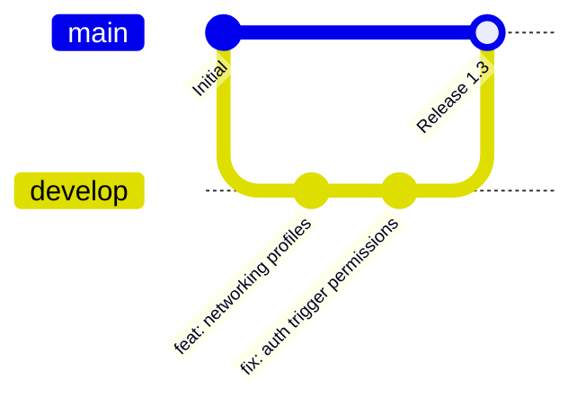

# Deployment & Operations Guide

This document describes how to deploy the CampusLink frontend client, set up the Supabase backend service, and manage environment configurations.

---

## 1. Local Development

To run the application locally for development and testing:

1. **Clone the repository**:
   ```bash
   git clone https://github.com/owaissaifi019-debug/Schoolin.git
   cd Schoolin
   ```
2. **Install CLI dependencies**:
   ```bash
   npm install
   ```
3. **Start local server**:
   ```bash
   npm run dev
   ```
   This runs an HTTP server on `http://localhost:3000`.

---

## 2. Git & GitHub Workflow

CampusLink developments follow the branch workflow below:



* **Main Branch** (`main`): Holds the production-ready code. Commits here trigger automated deployments to production.
* **Develop Branch** (`develop`): The integration branch for new features and tests.
* **Feature Branches**: Created for specific tasks, merged back to `develop` after review.

---

## 3. Vercel Deployment

The frontend static web files are hosted on **Vercel** with GitHub integration:

* **Build Commands**: None (leaves compile fields blank; Vercel serves the root repository as static directory hosts).
* **Output Directory**: `.` (root directory contains `index.html`).
* **Deployment Trigger**: Any push or merge to the `main` branch triggers an automated Vercel production build.

---

## 4. Supabase Setup

To set up a new Supabase environment, run the database schema migrations and configure the storage buckets:

### Step 1: Database Schema Creation
Run the SQL migrations inside the **Supabase SQL Editor** in the following order:
1. `supabase_schema.sql` (Creates core tables: `schools`, `profiles`, `events`, `admissions`).
2. `school_members_schema.sql` (School rosters and trigger mappings).
3. `messaging_schema.sql` (Real-time chats).
4. `notifications_schema.sql` (Alert lists).
5. `mentions_schema.sql` (User/School mentions in feed comments).
6. `post_reports_migration.sql` (Moderation systems).
7. `classroom_management_migration.sql` (Academic sessions and classrooms).

### Step 2: Storage Buckets Configuration
Create the following three storage buckets in the Supabase Dashboard under the **Storage** tab:
1. `avatars`
2. `school-logos`
3. `school-covers`

> [!IMPORTANT]
> Ensure that all three buckets are configured as **Public**. Write access is governed by the storage policies configured inside the sql migration scripts (e.g. `school_profile_uploads_migration.sql`).

### Step 3: Enable Realtime Publications
Run this SQL script to enable real-time message updates on the messaging tables:
```sql
ALTER PUBLICATION supabase_realtime ADD TABLE public.conversations;
ALTER PUBLICATION supabase_realtime ADD TABLE public.conversation_participants;
ALTER PUBLICATION supabase_realtime ADD TABLE public.messages;
```

---

## 5. Environment Variables & Credentials

Since this is a client-side static application, API credentials are configured directly inside [supabase.js](file:///e:/Owais/School%20Idea/SchoolIn/supabase.js):

```javascript
const SUPABASE_URL = 'https://cfeeqgokzkzblddefhxn.supabase.co';
const SUPABASE_ANON_KEY = 'eyJhbGciOiJIUzI1NiIsInR5cCI6...';
```

> [!WARNING]
> If transitioning from development to a staging or production Supabase instance, update `SUPABASE_URL` and `SUPABASE_ANON_KEY` in `supabase.js` to match the production keys.

---

## 6. Production Release Checklist

Before marking a build as ready for public launch, verify the following checklist items:

- [ ] **Database Connection**: Confirm the credentials inside `supabase.js` match the target database instance.
- [ ] **Signup Triggers**: Test user creation on `login.html` and verify the trigger successfully creates a profile row in the `profiles` table.
- [ ] **Realtime Messaging**: Open two browsers, sign in under separate profiles, and confirm messages deliver instantly via WebSockets channels.
- [ ] **Mobile Port Verification**: Compile static web assets using the Capacitor CLI and test on an Android emulator:
  ```bash
  npx cap sync android
  npx cap open android
  ```
