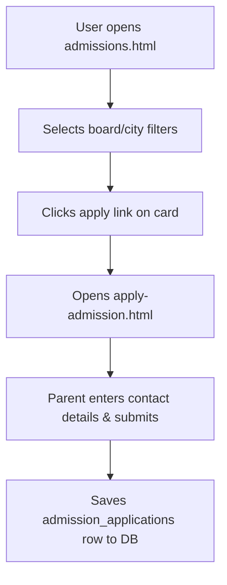

# Feature: School Admissions

This document details the admissions directory, filters, application form submissions, and the representative review boards.

---

## 1. Overview
The Admissions module connects parents and students with active school admission sessions, allowing them to apply directly.

---

## 2. Purpose
Simplifies the application process by providing a unified explorer of open admissions, eligibility details, last dates, and online submission forms.

---

## 3. Current Status
* **Status**: Completed / Active
* **Frontend Components**: `admissions.html`, `apply-admission.html`
* **Controller Logic**: `admissions.js`, `apply-admission.js`
* **Styles**: `admissions.css`

---

## 4. User Roles
* **Public Guest**: Can browse admission requirements and download school prospectus brochures.
* **Student / Parent**: Can submit admission applications.
* **School Admin**: Can publish admission sessions for their own school and review submitted applicant records.
* **Super Admin**: Global viewing and control.

---

## 5. Permissions
* **Admissions Directory**: Read access is public.
* **Admissions Posting**: Write access is scoped to school admins matching the school's `admin_user_id`.
* **Applications Submissions**: Users can insert and read their own applications (`applicant_user_id = auth.uid()`).
* **Representative Review**: Viewing applicant rosters is restricted to the hosting school's administrator.

---

## 6. Database Tables
* **Primary Tables**: `admissions`, `admission_applications`.
* **Reference Table**: `schools`.

---

## 7. UI Flow

---

## 8. Business Logic
* **Directory Filters**: Queries filter listings by city, board, and open grade levels using Supabase query modifiers.
* **Offline Fallbacks**: If the database query fails or returns empty, the client automatically loads fallback mock arrays from local storage to keep the UI functional.

---

## 9. Future Improvements
* Integrate payment gates to collect application fees online.
* Add document upload fields for academic records and DOB proofs.

---

## 10. Known Issues
* None reported.

---

## 11. Dependencies
* **Libraries**: Supabase SDK.

---

## 12. Screens
* **Explorer Board**: Cards grid showing open admissions, school names, boards, and deadlines.
* **Application Form**: Fields for student name, parent contact details, applied grade, DOB, address, and previous school.
