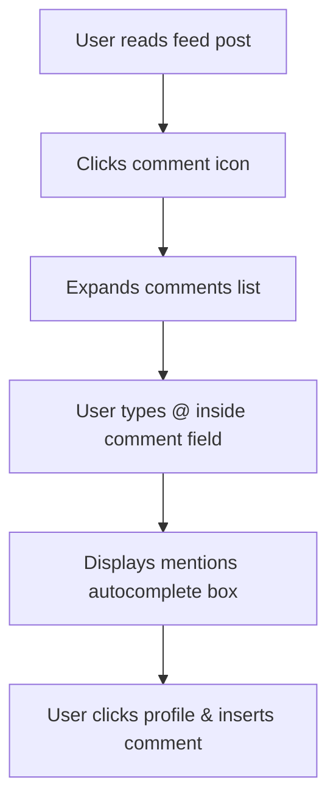

# Feature: Community, Comments & Moderation

This document details the community interaction features, likes, comments, user/school @mentions, and content moderation systems.

---

## 1. Overview
The Community module handles feed interactions, letting users like posts, comment, tag profiles/schools, and report inappropriate content.

---

## 2. Purpose
Fosters engagement by letting users ask questions, share fests highlights, and moderate content through a reporting system.

---

## 3. Current Status
* **Status**: Completed / Active
* **Frontend Components**: Integrated within `dashboard.html` / `dashboard.js`
* **JS Code modules**: `app.js` (mentions autocomplete popup)

---

## 4. User Roles
* **Student / Teacher / Alumni**: Can comment, like, tag profiles, and file complaints.
* **Post Creator**: Can delete comments on their posts.
* **Super Admin**: Has access to view post report audits, delete posts, and resolve or ignore complaints.

---

## 5. Permissions
* **Feed Interactions**: Read access is public. Authenticated users can comment, like, tag, and report.
* **Deletion**: Users can delete their own likes, comments, and posts. Post owners can delete comments on their posts.
* **Moderation Audit**: Viewing and resolving content reports in the `post_reports` table is restricted to super admins.

---

## 6. Database Tables
* **Primary Tables**: `comments`, `post_likes`, `mentions`, `post_reports`.
* **Reference Table**: `posts`.

---

## 7. UI Flow

---

## 8. Business Logic
* **Mentions Constraint**: Mentions records must target exactly one profile OR school page (`mentions_target_check` constraint).
* **Security Definer Deletions**: Because database RLS rules block students from deleting other users' likes or comments, deleting a post runs a database trigger (`tr_cascade_delete_post_dependencies`) as a `SECURITY DEFINER` to clear child records automatically.

---

## 9. Future Improvements
* Add support for nesting replies to comments.
* Include auto-flagging of profane words.

---

## 10. Known Issues
* None reported.

---

## 11. Dependencies
* **Libraries**: Supabase SDK.
* **Global Script**: `app.js` (provides autocomplete coordinates calculators).

---

## 12. Screens
* **Comments Tray**: Collapsible section displaying comments and user avatars.
* **Report Modal**: Popup menu listing violation reasons (Spam, Harassment, etc.) and detail text boxes.
