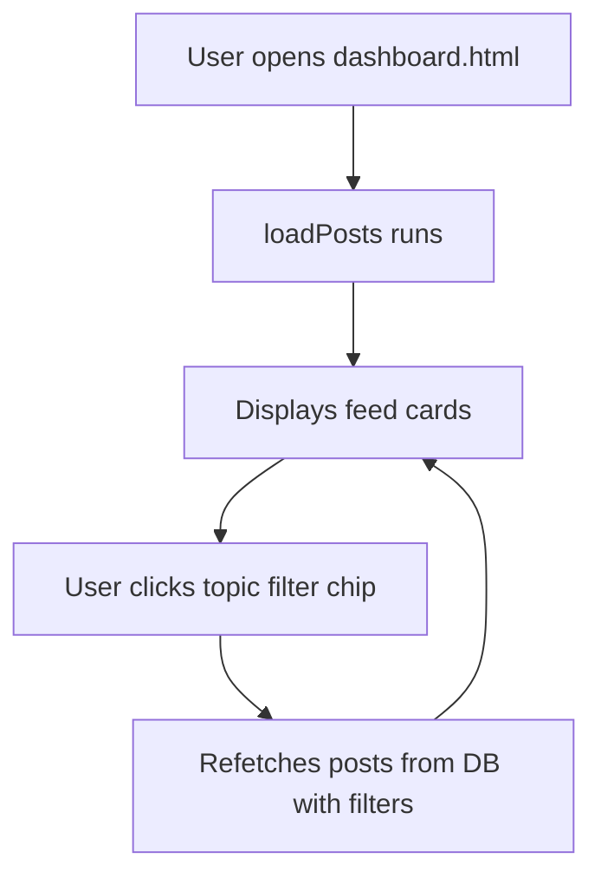

# Feature: Main Dashboard & Feed

This document details the main feed dashboard, topic filters, search directories, and posting capabilities of CampusLink.

---

## 1. Overview
The dashboard is the central hub of CampusLink, showing a dynamic feed of school activities, achievements, projects, and fests.

---

## 2. Purpose
Fosters communication by letting users read updates, filter feed items by specific topics, and post achievements or official school announcements.

---

## 3. Current Status
* **Status**: Completed / Active
* **Frontend Components**: `dashboard.html`
* **Controller Logic**: `dashboard.js`
* **Styles**: `style.css`

---

## 4. User Roles
* **Student / General Member**: Can browse feed posts, search, toggle filter chips, like/comment, and publish personal achievements.
* **School Representative**: Can write personal achievements or official posts on behalf of their associated school.
* **School Admin**: Can write official posts on behalf of their school.
* **Super Admin**: Can delete any post and resolve reported content.

---

## 5. Permissions

* **Read Access**: Anyone can read feed posts (including guest users).
* **Write Access**: Restricted to authenticated users. PostgreSQL triggers enforce the following posting permissions:
  * Only school admins or school representatives associated with a school can publish official school announcement posts.
  * Students and other members are restricted to personal posts.

---

## 6. Database Tables
* **Primary Table**: `posts`
* **Reference Table**: `profiles` (joins post creator details)

---

## 7. UI Flow

---

## 8. Business Logic
* **Post Filtering**: Posts are queried using Supabase `.select()` filters. If the user clicks a topic chip (e.g. `'competitions'`), the code appends `.eq('topic', 'competitions')` to the query.
* **Autocomplete Placement**: When creating a post, typing `@` activates a dropdown listing profiles. JavaScript calculates caret positions to float the suggestions panel directly below the cursor.

---

## 9. Future Improvements
* Add image/video attachments to posts.
* Support hash-tag index search arrays.

---

## 10. Known Issues
* None reported.

---

## 11. Dependencies
* **Libraries**: Supabase SDK.
* **Global Script**: `app.js` (provides caret position calculators for autocomplete overlays).

---

## 12. Screens
* **Feed Cards Grid**: Lists user achievements, school announcements, like icons, and comments sections.
* **Create Post Modal**: Popup panel with text fields and category selectors.
