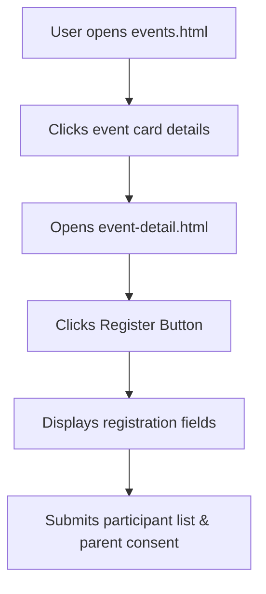

# Feature: Events Calendar & Registrations

This document details the events board, registration submission forms, and student team category entries.

---

## 1. Overview
The Events module lists upcoming inter-school competitions, science fests, sports tournaments, and webinars.

---

## 2. Purpose
Encourages student participation by hosting a central calendar and automated registration portal for individuals or school teams.

---

## 3. Current Status
* **Status**: Completed / Active
* **Frontend Components**: `events.html`, `event-detail.html`
* **Controller Logic**: `events.js`, `event-detail.js`
* **Styles**: `events.css`

---

## 4. User Roles
* **Public Guest**: Can browse events lists and check competition categories.
* **Student / Parent User**: Can register to participate (either individually or as part of a school team).
* **School Admin**: Can create event sessions for their school, manage registrants lists, and approve registration statuses.
* **Super Admin**: Global viewing and control.

---

## 5. Permissions
* **Events Directory**: Read access is public.
* **Events Posting**: Write access is scoped to school admins matching the school's `admin_user_id`.
* **Registration Submissions**: Users can register themselves (`student_id = auth.uid()`).
* **Representative Review**: Viewing applicant rosters is restricted to the hosting school's administrator.

---

## 6. Database Tables
* **Primary Tables**: `events`, `event_registrations`.
* **Reference Table**: `schools`.

---

## 7. UI Flow

---

## 8. Business Logic
* **Team Registration Mapping**: Supports group registrations by saving team names, team size, and team member descriptions directly inside text block fields.
* **Parent Consent Validation**: JavaScript blocks submission triggers if the parent consent checkbox is unchecked.

---

## 9. Future Improvements
* Add dynamic calendar invitations (Google Calendar).
* Support winner announcements and cert uploads on event completion.

---

## 10. Known Issues
* None reported.

---

## 11. Dependencies
* **Libraries**: Supabase SDK.

---

## 12. Screens
* **Calendar Directory**: List of fests with category tags, deadlines, and logo letters.
* **Details view**: Banner showing fest description, venue, coordinates, rules, and entry form trigger.
