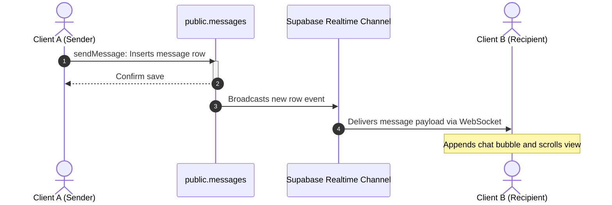

# Feature: Real-time Messaging & School Inquiries

This document details the real-time chat workspace, direct messaging threads, Websocket subscriptions, and automated school inquiry routing.

---

## 1. Overview
The Messaging module handles chat threads and real-time communication between users, or between users and school pages.

---

## 2. Purpose
Provides instant communication for networking connections and allows parents or students to contact schools directly about admissions, fests, or general inquiries.

---

## 3. Current Status
* **Status**: Completed / Active
* **Frontend Components**: `messaging.html`
* **Controller Logic**: `messaging.js`
* **Styles**: `messaging.css`

---

## 4. User Roles
* **Student / Teacher / parent / alumni**: Can message their connections or contact school pages.
* **School Representative / Admin**: Can reply to inquiries directed to their school page.

---

## 5. Permissions
* **Access Control**: Users can only view or message threads where they are registered as a participant in the `conversation_participants` table.
* **School Rep Replies**: Verified representatives of a school can view and reply to chats directed to their school page (`school_id`).

---

## 6. Database Tables
* **Primary Tables**: `conversations`, `conversation_participants`, `messages`.
* **Reference Tables**: `profiles`, `schools`.

---

## 7. UI Flow

---

## 8. Business Logic
* **Inquiry Routing**: When contacting a school page, the system automatically creates a conversation linking the initiator and the target `school_id`, categorizing it by type (e.g. `'admissions'`). Any school representative matching that school can view and reply.
* **Real-time Sync**: The controller subscribes to changes in `public.messages` using Supabase Realtime Channels, updating the chat history instantly when a message is received.

---

## 9. Future Improvements
* Add attachment sharing (images, pdfs) in chats.
* Add read indicators (typing..., delivered, read).

---

## 10. Known Issues
* None reported.

---

## 11. Dependencies
* **Libraries**: Supabase SDK (Realtime subscription layer).

---

## 12. Screens
* **Chat Dashboard**: Two-pane window displaying the conversation list on the left and the active chat history on the right.
* **Inquiry Trigger Overlay**: Quick-contact form on school profile pages to start inquiries.
