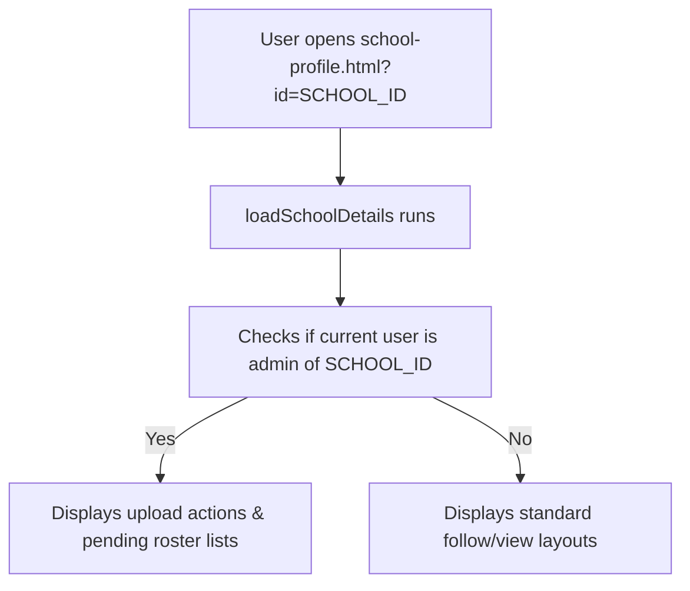

# Feature: School Profiles

This document details the public branding page, logo/cover photo customization, member directories, and verification badge systems for school pages.

---

## 1. Overview
School Profiles represent public landing hubs for onboarded schools. They showcase the school's basic details, verified members directory, active event calendars, and open admissions listings.

---

## 2. Purpose
Provides schools with a customizable space to manage their presence, approve student/teacher rosters, and publish admissions or event listings.

---

## 3. Current Status
* **Status**: Completed / Active
* **Frontend Components**: `school-profile.html`
* **Controller Logic**: `school-profile.js`
* **Styles**: `schools.css`

---

## 4. User Roles
* **Public Guest**: Can view school details, history, browse its members directory, events, and admissions listings.
* **School Representative**: Can request updates to school details.
* **School Admin**: Full editing rights. Can upload cover/logo files, edit about sections, manage membership roster requests (approve/reject/remove members).
* **Super Admin**: Full permissions. Can grant Blue or Gold verification badges.

---

## 5. Permissions
* **Read Access**: Anyone can view school profiles.
* **Write Access**: Scoped to school admins or school representatives. Updating details checks the user's `profiles.school_id` property.
* **Storage Access**: Uploading logos or cover photos requires the user's `profiles.school_id` to match the target school ID.

---

## 6. Database Tables
* **Primary Table**: `schools`
* ** Roster Mappings**: `school_members`
* **Reference Table**: `profiles`

---

## 7. UI Flow

---

## 8. Business Logic
* **Dynamic Brand Colors**: Binds gradient classes (e.g. `bg-gradient-1` class) to parent elements.
* **Roster Synchronization**: Approving a user triggers a database insert to `school_members`. A database trigger (`tr_sync_school_member_insert`) automatically updates the approved user's `profiles.school_id`.

---

## 9. Future Improvements
* Add a campus photo gallery slider.
* Support document upload for school accreditation verification.

---

## 10. Known Issues
* None reported.

---

## 11. Dependencies
* **Libraries**: Supabase SDK, storage APIs.

---

## 12. Screens
* **Main Banner**: Header displaying school name, badge, established year, and campus size against a brand gradient.
* **Roster Tabs**: Tab lists displaying verified students, teachers, and alumni profiles.
* **Admin Member Approvals Board**: Panel displaying pending member requests and status buttons (Approve/Reject) visible only to page administrators.
